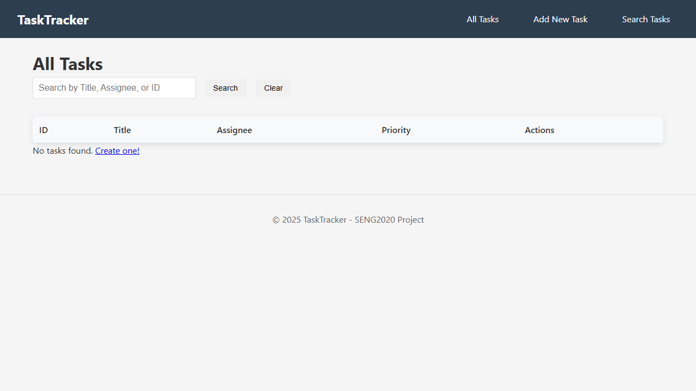
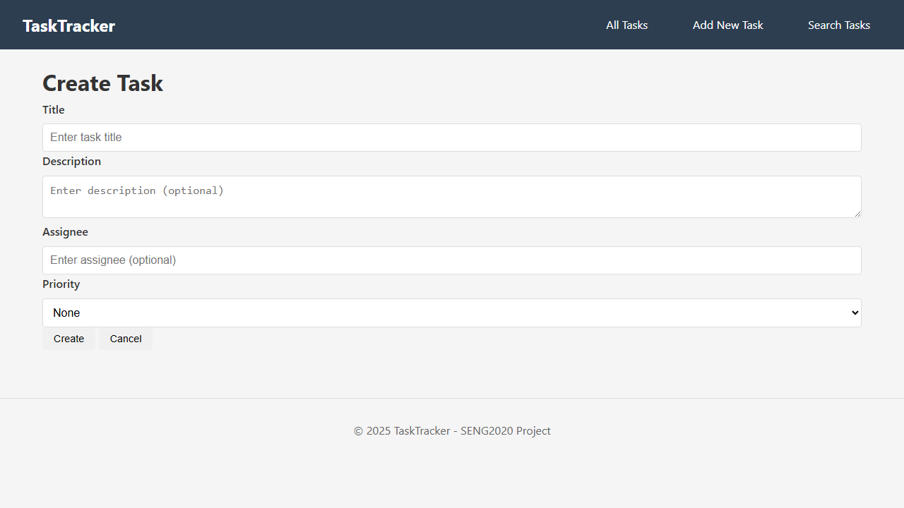
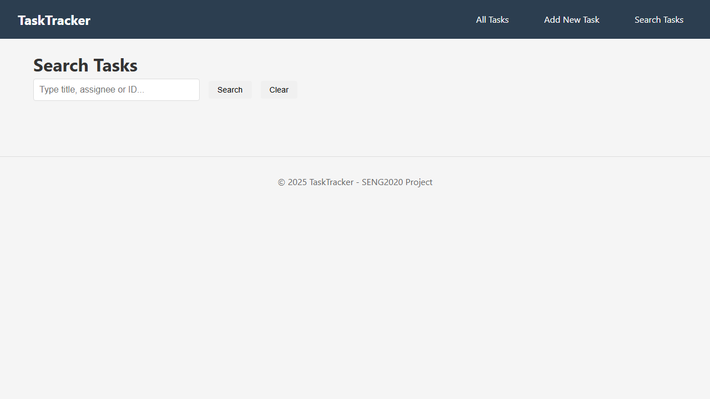

# TaskTrackerAPI

## Overview
TaskTrackerAPI is a small task management system built with ASP.NET Core and split into two runnable apps: a web UI (`TaskTracker`) and a standalone API (`TaskTrackerApi_SQ`). It demonstrates CRUD task workflows, lightweight service design, and API-first integration using in-memory storage. The goal is to show practical backend and integration habits in a student-scale project.

## Problem It Solves
Student teams and small projects often need a simple way to track work items without adding a full database stack. This project provides a lightweight task tracker where users can create, update, search, and remove tasks through a web interface backed by REST endpoints.

## Architecture
`Frontend (ASP.NET MVC + Razor) -> REST API -> In-memory task store`

- `TaskTracker` provides the UI and also exposes controller-based task endpoints.
- `TaskTrackerApi_SQ` provides a standalone minimal API service.
- The UI is configured to call the standalone API by default (`ApiSettings:BaseUrl`).

## Tech Stack
- .NET 8
- ASP.NET Core MVC (Razor Views)
- ASP.NET Core Minimal API
- C#
- In-memory storage (`List<T>` and `ConcurrentDictionary`)
- JavaScript (fetch API)
- CSS

## Key Features
- Create, view, update, and delete tasks
- Search tasks by title, assignee, or ID
- Manage assignee and priority
- Health endpoints for service status checks
- Versioned API routes (`/api/v1/...`) with backward-compatible `/api/...` routes

## Engineering Decisions
- **In-memory storage:** chosen intentionally to keep setup simple and focus on API and service design.
- **Additive API versioning:** `/api/v1/...` was added without removing existing `/api/...` routes to avoid breaking existing flows.
- **Config-driven integration:** frontend API base URL is read from configuration instead of being hardcoded in views.
- **Lightweight request logging:** both apps log HTTP method and path for quick diagnostics during development.

## Project Structure
- `TaskTracker/` MVC app (UI + controller-based API surface)
- `TaskTrackerApi_SQ/` standalone minimal API app
- `TaskTrackerAPI.http` runnable API request samples for local testing
- `docs/images/` screenshots for portfolio demo

## How to Run
1. Start the standalone API:
   ```bash
   dotnet run --project TaskTrackerApi_SQ/TaskTrackerApi_SQ.csproj
   ```
2. Start the MVC app:
   ```bash
   dotnet run --project TaskTracker/TaskTracker.csproj
   ```
3. Open the UI:
   - `https://localhost:7145`

Notes:
- Keep both apps running for end-to-end UI -> API flow.
- The default UI API base URL is configured in `TaskTracker/appsettings*.json`.

## API Endpoints
Primary endpoints (available under `/api/v1/...` and `/api/...`):

- `GET /api/v1/health`
- `GET /api/v1/tasks`
- `GET /api/v1/tasks/{id}`
- `POST /api/v1/tasks`
- `PUT /api/v1/tasks/{id}`
- `DELETE /api/v1/tasks/{id}`
- `PATCH /api/v1/tasks/{id}/assign`

Use `TaskTrackerAPI.http` for ready-to-run local examples.

## Visual Demonstration
### Task List


### Create or Edit Task


### Search Tasks


